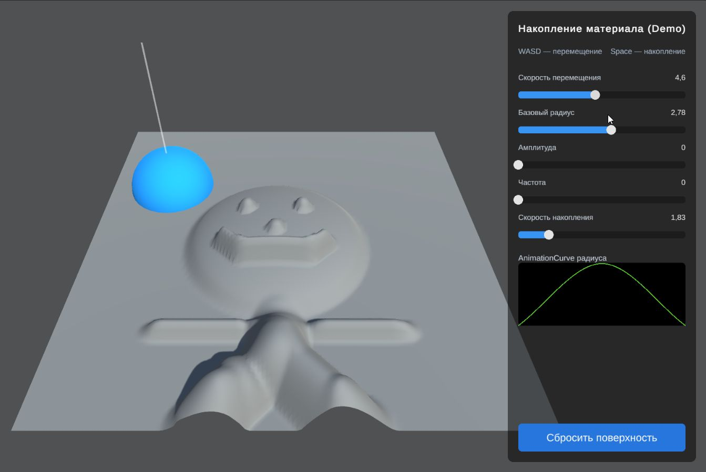

# Демонстрация накопления материала

Небольшая Unity-демонстрация накопления материала на поле высот.
Активная зона перемещается по поверхности, а удержание клавиши Space
увеличивает высоту ячеек внутри области действия.

## Запуск

1. Открыть проект в Unity `6000.5.9f1`.
2. Открыть сцену `Assets/_Project/Scenes/Main.unity`.
3. Нажать `Play` в редакторе Unity.

## Управление

- `WASD` — перемещение активной зоны.
- `Space` — накопление материала.
- Параметры движения и накопления изменяются через интерфейс во время выполнения.

## Технологический стек

- Unity `6000.5.9f1`.
- C#.
- Новая система ввода Unity.
- `R3` для реактивных свойств и подписок.
- `UniTask` в общей инфраструктуре интерфейса.
- `Zenject` для внедрения зависимостей.
- `uGUI` и `TextMeshPro` для пользовательского интерфейса.

## Архитектура и паттерны

### Конфигурация через данные

Параметры хранятся в ресурсе `MaterialAccumulationSettings`, созданном на
основе `ScriptableObject`. Во время выполнения используется отдельное
состояние настроек, поэтому изменения интерфейса не изменяют исходный ресурс.

### Событийная и реактивная модель

Система ввода публикует изменения направления движения и состояния накопления
через реактивные свойства. Логика подписывается на эти изменения и не опрашивает
клавиатуру напрямую в каждом участке игровой логики.

### Паттерн PIP

Интерфейс использует связку «посредник — протокол — представление». Посредник
получает данные игровой логики, протокол описывает свойства и команды, а
представление связывает их с заранее созданными элементами интерфейса.

### Внедрение зависимостей

`Zenject` создаёт контроллер и передаёт ему необходимые зависимости.
`MaterialAccumulationController` является обычным классом C# и не зависит от
жизненного цикла `MonoBehaviour`.

### Разделение состояния и отображения

`HeightField` хранит фактические значения высот и выполняет расчёты.
`HeightFieldMeshView` отвечает за отображение состояния на сетке и обновляет
только изменённую область.

## Почему достаточно обработки на процессоре

Для демонстрации используется поверхность размером `128 × 128` ячеек,
одна активная зона и локальная обработка области вокруг неё. При движении
траектория разбивается на подшаги, поэтому непрерывный проход не требует
обработки всей поверхности каждый кадр.

Массив высот переиспользуется, а в горячем участке не создаются новые коллекции
и массивы. Последовательная обработка в данном масштабе проще, предсказуемее и
легче проверяется, чем параллельный конвейер.

`C# Job System`, `Burst` и вычисления на видеокарте не добавлялись без
подтверждённого узкого места. Они потребовали бы более сложного обмена данными,
отладки и контроля синхронизации.

Переход к более сложному решению может потребоваться при существенном
увеличении разрешения, появлении нескольких одновременно работающих зон,
росте количества операций или подтверждённо высокой стоимости `AddStamp` и
`AddSweep` по данным профилировщика.

## Ограничения

- Поле высот не поддерживает нависающие участки.
- Качество поверхности зависит от разрешения сетки.
- Непрерывный проход является численной аппроксимацией.
- Большой радиус увеличивает стоимость обработки ячеек.

## Основные ресурсы

- Сцена: `Assets/_Project/Scenes/Main.unity`.
- Система ввода: `Assets/_Project/Input/MaterialAccumulation.inputactions`.
- Настройки: `Assets/_Project/Scripts/Features/MaterialAccumulation/Config/MaterialAccumulationSettings.asset`.
